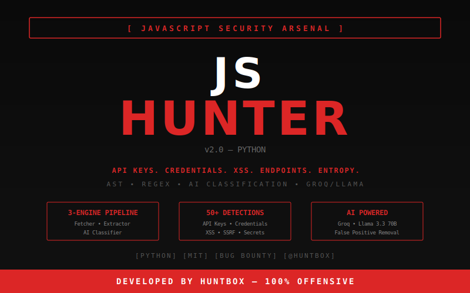

<p align="center">
  
</p>

<p align="center">
  <b>Advanced JavaScript Security Analyzer</b><br>
  <sub>Desenvolvido por <a href="https://github.com/MTheux">HuntBox</a> — Empresa 100% ofensiva — Pentest • Red Team • Bug Bounty</sub>
</p>

<p align="center">
  
  
  
  
  
</p>

---

## O que e o JSHunter?

JSHunter e uma ferramenta de analise de seguranca para arquivos JavaScript. Ele busca vulnerabilidades, segredos expostos, endpoints e dados sensiveis em arquivos `.js` remotos ou locais.

Diferente de ferramentas tradicionais baseadas apenas em regex, o JSHunter usa uma **arquitetura de 3 motores** com classificacao por IA para reduzir falsos positivos e entregar resultados precisos.

## Arquitetura — 3 Motores

```
URL ──▶ [ Motor 1: Fetcher ] ──▶ [ Motor 2: Extractor ] ──▶ [ Motor 3: AI Classifier ] ──▶ Resultado
              │                          │                            │
         Baixa o JS               AST + Regex +                Groq / Llama 3
         Beautifica               Entropia                     Classifica severity
         Source Map                50+ patterns                 Remove false positives
```

| Motor | Arquivo | Funcao |
|-------|---------|--------|
| **Fetcher** | `jshunter/engine/fetcher.py` | Download, beautify, source map detection |
| **Extractor** | `jshunter/engine/extractor.py` | AST (Esprima) + Regex + Shannon Entropy |
| **AI Classifier** | `jshunter/engine/ai_classifier.py` | Groq/Llama 3.3 70B classifica e filtra |

## O que detecta?

| Categoria | Exemplos | Patterns |
|-----------|----------|----------|
| **API Keys** | AWS, Google, GitHub, Stripe, Slack, Discord, Firebase, Twilio... | 43+ |
| **Credentials** | Hardcoded passwords, database strings, connection URIs | 6+ |
| **XSS/Vulns** | DOM sinks, eval, innerHTML, prototype pollution, SSRF, open redirect | 15+ |
| **Entropy** | Strings com alta entropia (possiveis secrets) | Shannon |
| **Endpoints** | REST APIs, GraphQL, WebSocket, internal paths | 16+ |
| **Emails** | Enderecos de email expostos no codigo | Regex |
| **Source Maps** | `.map` files que expoe codigo fonte original | Detection |

## Spider Mode

O Spider Mode transforma o JSHunter num crawler automatico de JavaScript. Em vez de informar URLs de arquivos `.js` manualmente, voce cola a **URL do site** e ele descobre tudo sozinho.

```
https://target.com ──▶ Playwright (Chromium headless)
                            │
                       Intercepta TODAS as requests .js via rede
                            │
                       Segue links internos (1 nivel, max 15 paginas)
                            │
                       Filtra lixo (libs conhecidas, tracking, min/max size)
                            │
                       Deduplica por URL
                            │
                       Motor 2 (Extractor) + Motor 3 (AI) em cada JS
                            │
                       Relatorio unificado
```

### Como funciona

- Abre um **browser real** (Chromium) em modo headless — nao usa regex pra adivinhar, pega o que o browser **realmente carrega**
- Intercepta requests de rede (`content-type: javascript`) — pega scripts dinamicos, webpack chunks, lazy imports
- Filtra por **same-origin + subdominios** (ex: `*.target.com`) — ignora CDNs externas
- Ignora **libs conhecidas** (jQuery, React, Angular, Bootstrap, analytics, recaptcha...)
- Filtra por tamanho: ignora < 500 bytes (tracking pixels) e > 20MB

### Filtros anti-lixo

| Filtro | Motivo |
|--------|--------|
| Network interception | So pega JS que o browser realmente carrega |
| Content-type check | Ignora HTML/CSS/imagens |
| Same-origin + subdomains | Foca no codigo do alvo |
| Known libs fingerprint | Pula jQuery, React, Angular etc |
| Min 500 bytes | Ignora tracking pixels |
| Max 20MB | Ignora bundles impossiveis |
| Dedup por URL | Mesmo script nao roda 2x |

### Uso

Na interface web, clique na aba **Spider**, cole a URL do site (nao do `.js`) e clique em **SPIDER**.

```
POST /api/spider
{ "url": "https://target.com" }
```

## Quick Start

### Requisitos

- Python 3.10+
- Conta Groq (gratis) para IA — [console.groq.com](https://console.groq.com)

### Instalacao

```bash
# Clone
git clone https://github.com/MTheux/JSHunter.git
cd JSHunter

# Instale dependencias
pip install -r requirements.txt

# Instale o Chromium para o Spider Mode
playwright install chromium

# Configure a API key do Groq
cp .env.example .env
# Edite o .env e coloque sua GROQ_API_KEY
```

### Configuracao do `.env`

```env
# JSHunter — Environment Variables
GROQ_API_KEY=gsk_sua_chave_aqui
```

> Pegue sua chave gratis em [console.groq.com/keys](https://console.groq.com/keys)

> **Sem a chave, o JSHunter funciona normalmente** (Motor 1 + 2 apenas, sem classificacao por IA).

### Uso — Web Interface

```bash
python app.py
# Acesse http://localhost:5000
```

### Uso — CLI

```bash
# URL unica
python js_analyzer.py https://target.com/app.js

# Multiplas URLs
python js_analyzer.py https://target.com/app.js https://target.com/vendor.js

# Arquivo com URLs
python js_analyzer.py -f urls.txt

# Exportar JSON
python js_analyzer.py https://target.com/app.js -o report.json
```

## Docker

```bash
# Build e run
docker-compose up -d

# Ou manualmente
docker build -t jshunter .
docker run -p 5000:5000 --env-file .env jshunter
```

## Estrutura do Projeto

```
jshunter/
├── engine/
│   ├── fetcher.py          # Motor 1 — Fetch + Beautify
│   ├── extractor.py        # Motor 2 — AST + Regex + Entropy
│   ├── ai_classifier.py    # Motor 3 — Groq/Llama AI
│   ├── analyzer.py         # Orchestrator dos 3 motores
│   ├── spider.py           # Spider Mode (Playwright/Chromium)
│   ├── ast_visitor.py      # Visitor AST (Esprima)
│   ├── entropy.py          # Shannon Entropy
│   └── patterns.py         # 50+ regex patterns
├── services/
│   ├── analyzer_service.py # Service layer
│   └── file_fetcher.py     # HTTP client com retry
├── routes/
│   ├── analysis.py         # POST /api/analyze
│   ├── spider.py           # POST /api/spider
│   ├── results.py          # GET /api/results
│   └── health.py           # GET /api/health
├── models/
│   └── results.py          # AnalysisResult dataclass
├── utils/
│   ├── validators.py       # URL/file validation
│   └── logger.py           # Colored logger
├── app.py                  # Flask factory
└── config.py               # Configuration
```

## API

### `POST /api/analyze`

```json
{
  "urls": ["https://target.com/app.js"]
}
```

### `POST /api/spider`

```json
{
  "url": "https://target.com"
}
```

Resposta:
```json
{
  "session_id": "...",
  "pages_crawled": 8,
  "scripts_found": 23,
  "total_files": 23,
  "results": [...]
}
```

### `GET /api/health`

```json
{
  "status": "operational",
  "version": "2.0.0",
  "author": "HuntBox"
}
```

## Severidades

| Nivel | Score | Descricao |
|-------|-------|-----------|
| **Critical** | 25 pts | Secrets reais expostos (API keys, passwords com valores) |
| **High** | 15 pts | Vulnerabilidades exploraveis (XSS, eval com input) |
| **Medium** | 8 pts | Padroes potencialmente perigosos |
| **Low** | 3 pts | Violacoes menores de boas praticas |
| **Info** | 1 pt | Informacional (frameworks, endpoints) |

> Com IA ativa, o Motor 3 reclassifica e remove **false positives** automaticamente.

## Stack

- **Backend:** Python, Flask, Esprima (AST)
- **AI:** Groq Cloud, Llama 3.3 70B Versatile
- **Spider:** Playwright, Chromium (headless browser)
- **Frontend:** Vanilla JS, CSS Grid, Font Awesome
- **Deploy:** Docker, docker-compose

## Disclaimer

Esta ferramenta foi desenvolvida para fins de **pentest autorizado**, **red team** e **bug bounty**. Use apenas em alvos que voce tem autorizacao para testar. O uso indevido e de responsabilidade do usuario.

---

<p align="center">
  <b>HuntBox</b> — 100% Offensive<br>
  <sub>Pentest • Red Team • Bug Bounty</sub>
</p>
